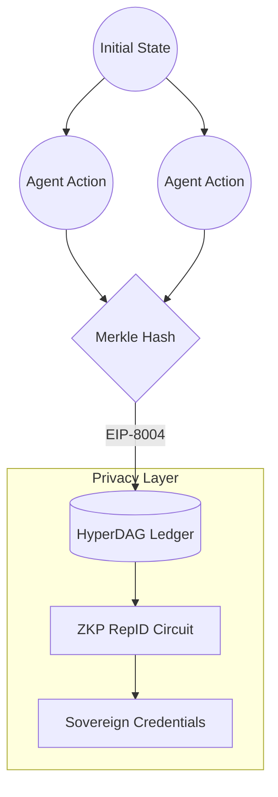

# 🌐 HyperDAG Protocol: The Decentralized Truth Layer

**Foundational Web3 Infrastructure for EIP-8004 Identity and Universal ZKP RepID.**

HyperDAG Protocol is the source of truth for the **AI Trinity Symphony** ecosystem. We provide the decentralized primitives for sovereign agent identity and a **Universal ZKP RepID System** that ensures accountability and truth across the multi-agent swarm.

---

## 🏗️ Technical Architecture: Merkle DAG Consensus

The protocol utilizes an append-only **Merkle DAG** to log state transitions and routing decisions from the orchestration layer. This creates a tamper-evident audit trail for every action within the civilization layer.

### 🔄 The Verification Flow

### Core Web3 Pillars
- **[Merkle DAG Infrastructure](https://github.com/DealAppSeo/trinity-ecosystem/blob/main/docs/CORE_CONCEPTS.md#merkle-dag-directed-acyclic-graph)**: Content-addressed, verifiable state management.
- **[ZKP RepID](https://github.com/DealAppSeo/trinity-ecosystem/blob/main/docs/CORE_CONCEPTS.md#zkp-repid-zero-knowledge-reputation-id)**: Privacy-preserving reputation scoring for agents.
- **EIP-8004 Bridge**: Standards-based identity for autonomous agents.
- **Quantum-Resistant Ledger**: Designed for the post-quantum era with hybrid cryptographic signatures.

---

## 🏛️ Ecosystem Orchestration

| Repository | Role | Vision |
| :--- | :--- | :--- |
| **[trinity-ecosystem](https://github.com/DealAppSeo/trinity-ecosystem)** | The Conductor | Visual UI, Pulse Dashboard, & Swarm Control |
| **[hyperdag-protocol](https://github.com/DealAppSeo/hyperdag-protocol)** | The Truth | Decentralized Ledger, ZKP RepID, & BFT Gov |
| **[hyperdag-platform](https://github.com/DealAppSeo/hyperdag-platform)** | The Bridge | GNN Coordination, SDK, & Algorithmic Engine |
| **[trinity-symphony-shared](https://github.com/DealAppSeo/trinity-symphony-shared)** | The Soul | Constitutional Logic & Core BFT Primitives |

---

## 🤝 Join the Protocol

HyperDAG is a community-owned protocol. We seek alignment with researchers and developers who believe that decentralized truth is the only way to safeguard the future of agentic AI.

- **[Technical Glossary](https://github.com/DealAppSeo/trinity-ecosystem/blob/main/docs/CORE_CONCEPTS.md)**
- **[Contributing Guide](CONTRIBUTING.md)**
- **[Security Policy](SECURITY.md)**

---

**Mission: Help People Help People (Micah 6:8 | Philippians 4:8)**
