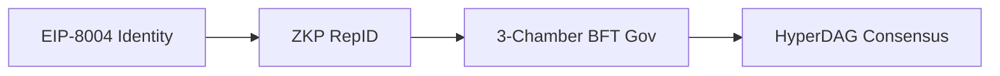

# HyperDAG Protocol Core 🌐

> **Foundational Infrastructure for EIP-8004 Identity and Universal ZKP RepID**

HyperDAG Protocol is the Web3 source of truth for the **AI Trinity Symphony** ecosystem. We provide the decentralized primitives for sovereign agent identity and a **Universal ZKP RepID System** that promotes agents (both human and digital) who **help people help people**.

## 🕊️ Mission: Ethical Co-opetition
We are building a democratized, safe, and ethical AI layer. We seek alignment with those who believe that AI should serve humanity's highest calling, grounded in **Philippians 4:8** and **Micah 6:8**.

## 🏗️ Architecture

## 🛠️ Tech Stack
- **Smart Contracts**: Solidity (Foundry/Hardhat)
- **Privacy**: Circom (ZK-SNARKs)
- **Standards**: EIP-8004, EIP-712, x402
- **Governance**: BFT 3x3+3 Multi-Chamber DAO

## 🤝 Join the Dev Ecosystem
Instead of forking to compete, we invite you to build on top of our shared protocol. Patents are held defensively to ensure this technology remains **for the people, by the people**.

[Contributing](CONTRIBUTING.md) • [Security](SECURITY.md) • [Code of Conduct](CODE_OF_CONDUCT.md)
