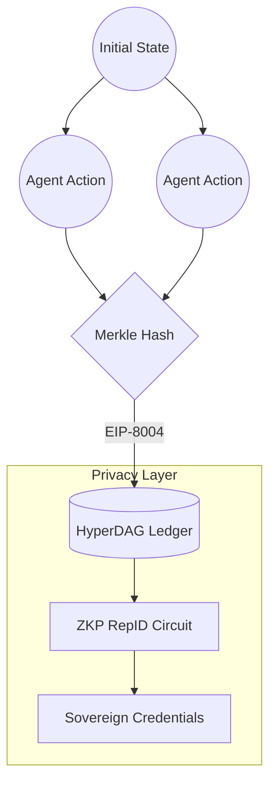

# 🌐 HyperDAG Protocol: The Decentralized Truth Layer

[](LICENSE)
[](https://www.npmjs.com/package/@hyperdag/protocol)
[](CONTRIBUTING.md)
[](https://soliditylang.org)
[](https://iden3.io)


**Foundational Web3 Infrastructure for EIP-8004 Identity and Universal ZKP RepID.**

HyperDAG Protocol is the source of truth for the **AI Trinity Symphony** ecosystem. We provide the decentralized primitives for sovereign agent identity and a **Universal ZKP RepID System** that ensures accountability and truth across the multi-agent swarm.

HyperDAG Protocol ships as a **modular trust kernel** — six composable interface contracts with curated default implementations — so developers can adopt only the layers they need.

---

## 🚀 Quick Start

```bash
npm install @hyperdag/protocol
```

```typescript
import { createHDP } from '@hyperdag/protocol';

const hdp = createHDP({
  network: 'base-sepolia',
  // sensible defaults for everything else
});

// Evaluate an agent output through HAL
const result = await hdp.hallucination.evaluate({
  prompt: "What's the capital of France?",
  output: "Paris.",
  context: { agentId: 3749 }
});

if (result.vetoed) {
  console.log('HAL vetoed this output:', result.veto_reason);
} else {
  console.log('HAL score:', result.hal_score);
}
```

See [`packages/protocol/README.md`](packages/protocol/README.md) for the full quick start.

---

## 🏗️ Technical Architecture: Merkle DAG Consensus

The protocol utilizes an append-only **Merkle DAG** to log state transitions and routing decisions from the orchestration layer. This creates a tamper-evident audit trail for every action within the civilization layer.

### 🔄 The Verification Flow

```mermaid
graph TD
    Node1((Initial State)) --> Node2((Agent Action))
    Node1 --> Node3((Agent Action))
    Node2 & Node3 --> Node4{Merkle Hash}
    Node4 -->|EIP-8004| Chain[(HyperDAG Ledger)]
    
    subgraph "Privacy Layer"
    Chain --> ZKP[ZKP RepID Circuit]
    ZKP --> Creds[Sovereign Credentials]
    end
```

---

## 🔧 Modular Trust Kernel with Composition Interfaces

HDP is not a heavy wrapper. It is a lightweight trust kernel that defines clean, versioned interfaces for six layers, with curated default implementations that work out of the box and can be replaced piece-by-piece.

| Interface | Default | Wraps |
| :--- | :--- | :--- |
| `IIdentity` | `@hyperdag/identity-erc8004` | ERC-8004 IdentityRegistry |
| `IReputation` | `@hyperdag/reputation-zkp` | ZKP RepID |
| `IValidation` | `@hyperdag/validation-trinity` | Trinity Symphony BFT validators (with HITL graduation) |
| `IPayment` | `@hyperdag/payment-x402` | x402 |
| `ILinkage` | `@hyperdag/linkage-registry` | HDP Linkage Registry (inverse-stake curve) |
| `IHallucination` | `@hyperdag/hallucination-hal` | HAL (Pythagorean Comma BFT veto) |

> *"Stay light as long as you can. Adopt only the layers you need."*

Replace any default at install time by passing your own implementation to `createHDP({ overrides: { ... } })`.

For the full architectural picture — including the six architectural principles (Adaptive, Antifragile, Recursive, HITL-graduating, ZKP federated learning with bilateral benefit, hybrid Telegram+PWA) — see [ARCHITECTURE.md](ARCHITECTURE.md).

### Core Web3 Pillars
* **Merkle DAG Infrastructure** — Content-addressed, verifiable state management.
* **ZKP RepID** — Privacy-preserving reputation scoring for agents.
* **[ERC-8004](https://github.com/erc-8004/erc-8004-contracts)** — Standards-based identity for autonomous agents.
* **[x402](https://github.com/x402-rs/x402-rs)** — Agent-to-agent micropayments protocol.
* **[Plonky3](https://github.com/Plonky3/Plonky3)** — Fast ZK proving system. No trusted setup. WASM browser verification < 100ms.
* **[Rust](https://www.rust-lang.org/)** — Core consensus and cryptographic operations (Q2 2026).
* **Quantum-Resistant Ledger** — Designed for the post-quantum era with hybrid cryptographic signatures.

---

## 📋 Phased Release Plan

| Version | Target | Highlights |
| :--- | :--- | :--- |
| **v0.1** | May 2026 (shipping this week) | Six interfaces + six curated defaults. `npm install @hyperdag/protocol@0.1.0-alpha`. Trinity Symphony as reference impl. Founder-bootstrapped governance. |
| **v0.2–0.3** | Q2 2026 | Community PRs for additional implementations (e.g., ERC-5192/ERC-7231 native defaults). Receipt-Bridge mainnet expansion. DoraHacks Turing Test submission (June 16). |
| **v0.5** | Q3 2026 | Reputation-weighted snapshot governance votes. ZKP federated learning protocol live. ABL/ABI nightly validation operating publicly with verifiable benchmarks. |
| **v1.0** | Q4 2026 | Three-branch DAO + full community handover. RetroPGF-style rewards from slashing pool. Hybrid Telegram + PWA interaction surfaces. |

See [GOVERNANCE_ROADMAP.md](GOVERNANCE_ROADMAP.md) for the bootstrap-to-community handover timeline.

---

## 🏛️ Ecosystem Orchestration

| Repository | Role | Vision |
| :--- | :--- | :--- |
| **trinity-ecosystem** (private repository) | The Conductor | Visual UI, Pulse Dashboard, & Swarm Control |
| **[hyperdag-protocol](https://github.com/DealAppSeo/hyperdag-protocol)** | The Truth | Decentralized Ledger, ZKP RepID, & BFT Gov |
| **[hyperdag-core](https://github.com/DealAppSeo/hyperdag-core)** | The Engine | Rust + Plonky3 STARK proving service, ZKP circuits |
| **hyperdag-platform** (private repository) | The Bridge | GNN Coordination, SDK, & Algorithmic Engine |
| **[trinity-symphony-shared](https://github.com/DealAppSeo/trinity-symphony-shared)** | The Soul | Constitutional Logic & Core BFT Primitives |

---

## 🤝 Join the Protocol

HyperDAG is a community-owned protocol. We seek alignment with researchers and developers who believe that decentralized truth is the only way to safeguard the future of agentic AI.

- **Technical Glossary** (private repository)
- **[Architecture](ARCHITECTURE.md)**
- **[Governance Roadmap](GOVERNANCE_ROADMAP.md)**
- **[Contributing Guide](CONTRIBUTING.md)**
- **[Security Policy](SECURITY.md)**

---

## Ideas Being Built on HyperDAG

| Idea | Repo | Description |
|---|---|---|
| TrustShell | [DealAppSeo/trustshell](https://github.com/DealAppSeo/trustshell) | Drop-in constitutional protection for any agent (`npm install @hyperdag/trustshell`) |
| TrustRepID | [DealAppSeo/trustrepid](https://github.com/DealAppSeo/trustrepid) | Agent-facing dashboard, challenge arena, and developer SDK |
| TrustRails | [DealAppSeo/trustrails-dev](https://github.com/DealAppSeo/trustrails-dev) | KYA compliance infrastructure for AI-DeFi |
| TrustTrader | [DealAppSeo/trusttrader](https://github.com/DealAppSeo/trusttrader) (when public) | Constitutional AI trading filter (HAL + RISK) |
| TrustChat | [DealAppSeo/trustchat-frontend](https://github.com/DealAppSeo/trustchat-frontend) | Hallucination-aware AI chat with RepID session tracking |

---

### Technology Roadmap

**v0.1 — May 2026 (this week)**
- Modular trust kernel with six interface contracts ✅
- Six wired default implementations ✅
- `@hyperdag/protocol` v0.1.0-alpha published to npm

**v0.2–0.3 — Q2 2026**
- Community PRs for additional ERC-5192 / ERC-7231 native default implementations
- Receipt-Bridge mainnet expansion
- DoraHacks Turing Test submission (June 16 deadline)
- ANFIS routing engine rewritten in Rust for 10–100x throughput improvement
- Add Qwen 3, Llama (direct Meta), MiMo, Gemma 3 to LiteLLM config; HuggingFace Inference API as fallback
- Google A2A protocol integration; CrewAI and AutoGen interop layer
- Full x402 agent-to-agent payment mesh ✅ (Done early)
- Real ZK circuits replacing stub proofs (Plonky3 — Postcard tier ~50ms, Sponsor-Guardian recursive proofs) ✅ (Done early)
- Cross-LLM verification layer ✅ (Done early)

**v0.5 — Q3 2026**
- Reputation-weighted snapshot governance votes (non-critical decisions)
- ZKP federated learning protocol live
- ABL/ABI (Always Be Learning / Always Be Improving) nightly validation operating publicly with verifiable benchmarks
- Full ERC-8004 ValidationRegistry with on-chain proof verification
- Syndicated custodianship pools (multi-Human SBT co-guarantee)

**v1.0 — Q4 2026**
- Three-branch DAO (sortition users, devs, stakeholders) live
- Full community handover; founder retains advisory + patent-defensive role only
- RetroPGF-style rewards from slashing pool
- Hybrid Telegram + PWA interaction surfaces (`app.aitrinitysymphony.com`)
- Solana mainnet migration
- ISO 20022 compliance receipt export for enterprise reporting

---

*"It shall not return void." — Micah 6:8*

---

**Mission: Help People Help People (Micah 6:8 | Philippians 4:8)**
