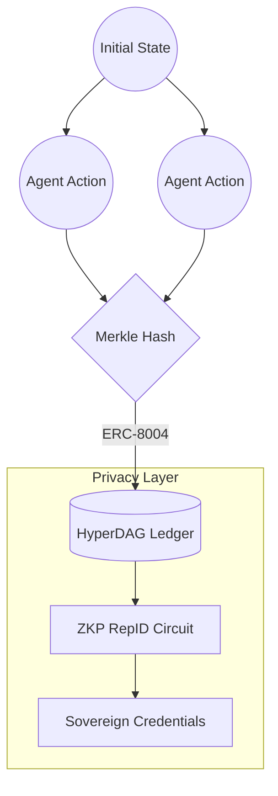

# 🌐 HyperDAG Protocol

**A modular trust kernel for ERC-8004 agent identity and ZKP reputation.**

HyperDAG Protocol provides the decentralized primitives for agent identity and a ZKP-based RepID system
in the **AI Trinity Symphony** ecosystem.

---

## 🏗️ Technical Architecture: Merkle DAG Consensus

The protocol uses an append-only **Merkle DAG** to log state transitions and routing decisions from the
orchestration layer, producing a tamper-evident audit trail for each action.

### 🔄 The Verification Flow

```mermaid
graph TD
    Node1((Initial State)) --> Node2((Agent Action))
    Node1 --> Node3((Agent Action))
    Node2 & Node3 --> Node4{Merkle Hash}
    Node4 -->|ERC-8004| Chain[(HyperDAG Ledger)]
    
    subgraph "Privacy Layer"
    Chain --> ZKP[ZKP RepID Circuit]
    ZKP --> Creds[Sovereign Credentials]
    end
```

### Core Web3 Pillars
* **Merkle DAG Infrastructure** — Content-addressed, verifiable state management.
* **ZKP RepID** — Privacy-preserving reputation scoring for agents.
* **[ERC-8004](https://github.com/erc-8004/erc-8004-contracts)** — Standards-based identity for autonomous agents.
* **[x402](https://github.com/x402-rs/x402-rs)** — Agent-to-agent micropayments protocol.
* **[Plonky3](https://github.com/Plonky3/Plonky3)** — ZK proving system. No trusted setup. WASM browser verification < 100ms.
* **[Rust](https://www.rust-lang.org/)** — Core consensus and cryptographic operations (planned, Q2 2026).

---

## 🏛️ Ecosystem Orchestration

| Repository | Role |
| :--- | :--- |
| **trinity-ecosystem** (private repository) | Visual UI, dashboard, and swarm control |
| **[hyperdag-protocol](https://github.com/DealAppSeo/hyperdag-protocol)** | Decentralized ledger, ZKP RepID, and BFT governance |
| **[hyperdag-core](https://github.com/DealAppSeo/hyperdag-core)** | Rust + Plonky3 STARK proving service, ZKP circuits |
| **hyperdag-platform** (private repository) | GNN coordination, SDK, and routing engine |
| **[trinity-symphony-shared](https://github.com/DealAppSeo/trinity-symphony-shared)** | Constitutional logic & core BFT primitives |

---

## 🤝 Contributing

HyperDAG is an open, community-oriented protocol. Contributions from researchers and developers are welcome.

- **Technical Glossary** (private repository)
- **[Contributing Guide](CONTRIBUTING.md)**
- **[Security Policy](SECURITY.md)**

---

## Ecosystem

HyperDAG Protocol is the identity and reputation infrastructure layer beneath a growing ecosystem of trust products.

### Infrastructure Repos

| System | Public Repo | Private Repo |
|---|---|---|
| HyperDAG Protocol | This repo | `hyperdag-platform` (private) |
| HyperDAG Core | [hyperdag-core](https://github.com/DealAppSeo/hyperdag-core) | |
| AI Trinity Symphony | [trinity-symphony-shared](https://github.com/DealAppSeo/trinity-symphony-shared) | `trinity-ecosystem` (private repository) |

### Ideas Being Built on HyperDAG

| Idea | Link | Description |
|---|---|---|
| TrustShell | [trustshell.dev](https://trustshell.dev) | Drop-in constitutional protection for any agent (`npm install @hyperdag/trustshell`) |
| TrustRepID | [trustrepid.dev](https://trustrepid.dev) | Agent-facing dashboard, challenge arena, and developer SDK |
| TrustRails | [trustrails.dev](https://trustrails.dev) | KYA compliance infrastructure for AI-DeFi |
| TrustTrader | [trusttrader.dev](https://trusttrader.dev) (when public) | Constitutional AI trading filter (HAL + RISK) |
| TrustChat | [trustchat.dev](https://trustchat.dev) | Hallucination-aware AI chat with RepID session tracking |

## 🔗 Related Projects in the Ecosystem

- [hyperdag-protocol](https://github.com/DealAppSeo/hyperdag-protocol) — The L1 specification.
- [hyperdag-core](https://github.com/DealAppSeo/hyperdag-core) — ZKP primitives.
- [trinity-symphony-shared](https://github.com/DealAppSeo/trinity-symphony-shared) — Agent infrastructure.
- [repid](https://github.com/DealAppSeo/repid) — The reputation engine.
- [trustrepid](https://github.com/DealAppSeo/trustrepid) — SDK and integration layer.

### Technology Roadmap

**Performance (Q2 2026, planned)**
- ANFIS routing engine rewritten in Rust for higher throughput
- ZKP circuit compilation using [Plonky3](https://github.com/Plonky3/Plonky3) — no trusted setup, recursive composition, WASM support

**LLM expansion (Q2 2026, planned)**
- Additional models in the LiteLLM config (e.g. Qwen 3, Llama, Gemma 3)
- HuggingFace Inference API as fallback provider

**Agent interoperability (Q3 2026, planned)**
- Google A2A protocol integration
- CrewAI and AutoGen interop layer
- Full x402 agent-to-agent payment mesh ✅ (shipped)

**Identity and privacy (Q3 2026, planned)**
- Real ZK circuits replacing stub proofs (Plonky3) ✅ (shipped)
- Full ERC-8004 ValidationRegistry with on-chain proof verification
- Syndicated custodianship pools (multi-Human SBT co-guarantee)

---

*"It shall not return void." — Micah 6:8*

---

**Mission: Help People Help People (Micah 6:8 | Philippians 4:8)**
