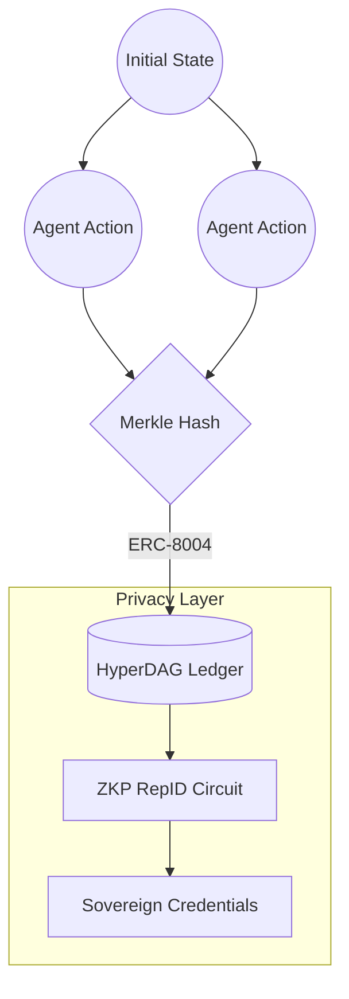

# HyperDAG Protocol

**Open implementation of ERC-8004 reputation primitives for autonomous agents. Apache 2.0.**

[](LICENSE)
[](https://ethereum-magicians.org/t/erc-8004-trustless-agents/25098)
[](https://www.npmjs.com/package/@hyperdag/protocol)
[](https://soliditylang.org)
[](https://sepolia.basescan.org/address/0x8004B663056A597Dffe9eCcC1965A193B7388713)
[](CONTRIBUTING.md)

HyperDAG is a lightweight, composable trust kernel for autonomous agents: six versioned interfaces (identity, reputation, validation, payment, linkage, hallucination) with curated defaults that target ERC-8004 + adjacent standards out of the box. Replace any layer you want; keep the rest.

---

## Live on Base Sepolia (chain ID 84532)

Both canonical registries are live and writing every day. Everything below is verifiable from any RPC client or basescan:

| Contract | Address |
|---|---|
| **IdentityRegistry** | [`0x8004A818BFB912233c491871b3d84c89A494BD9e`](https://sepolia.basescan.org/address/0x8004A818BFB912233c491871b3d84c89A494BD9e) |
| **ReputationRegistry** | [`0x8004B663056A597Dffe9eCcC1965A193B7388713`](https://sepolia.basescan.org/address/0x8004B663056A597Dffe9eCcC1965A193B7388713) |

---

## Receipts

Real on-chain ERC-8004 activity from a production agent fleet. Every number is verifiable on basescan; honest gaps are noted inline.

- **4 agents minted** on the canonical IdentityRegistry: `trinity-sophia` (token `3747`), `trinity-apm` (`1585`), `trinity-veritas` (`5864`), `trinity-shofet` (`5863`). *(8 more are operational off-chain and unminted today — see honest gaps below.)*
- **32 real on-chain reputation writes** from the agent economy in the last ~7 days; concentrated production push, not synthetic backfill. Gas per write: ~134,661.
- Most recent attestations *(one per minted agent):*
  - `sophia` → RepID **9,581** · [`0x24251cbb…ca9301`](https://sepolia.basescan.org/tx/0x24251cbb786d9ca8b03e4d56887a46f9040ddc1336826d80021ff39b91ca9301) · block 41,873,128
  - `apm` → RepID **7,010** · [`0x54da7350…ba2fd8`](https://sepolia.basescan.org/tx/0x54da7350eeed8527fcec80fb945bd7ff33dd2d98a5bacd50c1a0655692ba2fd8) · block 41,873,368
  - `veritas` → RepID **5,589** · [`0xa8474d5d…c9c2f2`](https://sepolia.basescan.org/tx/0xa8474d5dac601d3c04d0133f5cf55a9273d226e366a0a807b16691cfd7c9c2f2) · block 41,873,608
  - `shofet` → RepID **3,120** · [`0xb2ab22b5…caed09`](https://sepolia.basescan.org/tx/0xb2ab22b536abb7dc08d19a030b6e491face37387834dd361fba0d705accaed09) · block 41,934,427

**Honest gaps:** of the 12 trinity agents in the live fleet, only 4 have ERC-8004 tokens on the canonical IdentityRegistry today. The other 8 (`nexus`, `orch`, `w3c`, `chesed`, `mel`, `torch`, `gcm`, `hdm`) earn RepID off-chain and are queued for mint.

---

## Three Trust Models — ERC-8004 → HyperDAG mapping

ERC-8004 defines three composable trust mechanisms; HyperDAG ships one curated default for each, all swappable via the corresponding interfaces:

| ERC-8004 mechanism | HyperDAG default | How it works |
|---|---|---|
| **Reputation** (delegated trust via on-chain attestations) | `IReputation` → `@hyperdag/reputation-zkp` | Per-agent RepID 0–10,000; writes go to the canonical `ReputationRegistry` (live above). Optional ZKP RepID circuit (Plonky3) for privacy-preserving score proofs. |
| **Validation** (independent re-execution / cross-check) | `IValidation` → `@hyperdag/validation-trinity` | BFT validator set with HITL graduation; cross-LLM agreement check (Phase 1.5) for factual / time-sensitive prompts; `IHallucination` veto sits in the same chain. |
| **TEE Attestation** (verifiable execution receipts) | `IValidation` extension *(roadmap V2)* | The ZKP RepID circuit provides a verifiable-attestation flavor today; first-class TEE-backed ValidationRegistry support is roadmap (see V2 below). |

---

## Threat model — what the kernel defends against

| Class | What HyperDAG does |
|---|---|
| **Hallucination** | `IHallucination` (HAL) routes every agent decision through a 5-signal extractor (harm · epistemic uncertainty · evidence quality · scope · certainty) + optional 6th cross-LLM agreement signal. Pythagorean Comma combiner; runtime-tunable veto / block thresholds. |
| **Constitutional drift** | Thresholds (`hal_veto_threshold`, `hal_block_threshold`) and per-profile gating (conservative / balanced / pro) are stored in the engine's config — operators retune against live traffic without a redeploy. Drift is measured, not just blocked. |
| **Unproven identity** | `IIdentity` reads the canonical `IdentityRegistry`; standard ERC-8004 reputation/attestation lookups (`getRepID`, `getReputationHistory`, `getAttestation`) verify any counterparty before action. |
| **Reputation lock-in** | RepID is anchored on ERC-8004 (portable on-chain). Move an agent between platforms without losing earned trust. |

---

## Quick start

```bash
npm install @hyperdag/protocol
```

```typescript
import { createHDP } from '@hyperdag/protocol';

const hdp = createHDP({ network: 'base-sepolia' });

// Evaluate an agent output through the HAL pipeline
const result = await hdp.hallucination.evaluate({
  prompt: "What's the capital of France?",
  output: "Paris.",
  context: { agentId: 3749 }
});

if (result.vetoed) console.log('HAL vetoed:', result.veto_reason);
else                console.log('HAL score:', result.hal_score);
```

See [`packages/protocol/README.md`](packages/protocol/README.md) for the full quick start.

---

## Modular trust kernel — six interfaces, six defaults

HDP is not a heavy wrapper. It is a lightweight kernel defining clean versioned interfaces; the curated defaults work out of the box and can be replaced piece-by-piece.

| Interface | Default | Wraps |
| :--- | :--- | :--- |
| `IIdentity` | `@hyperdag/identity-erc8004` | ERC-8004 IdentityRegistry |
| `IReputation` | `@hyperdag/reputation-zkp` | ZKP RepID |
| `IValidation` | `@hyperdag/validation-trinity` | BFT validators (with HITL graduation) |
| `IPayment` | `@hyperdag/payment-x402` | x402 |
| `ILinkage` | `@hyperdag/linkage-registry` | HDP Linkage Registry (inverse-stake curve) |
| `IHallucination` | `@hyperdag/hallucination-hal` | HAL (Pythagorean Comma BFT veto) |

> *"Stay light as long as you can. Adopt only the layers you need."*

Replace any default at install time: `createHDP({ overrides: { ... } })`. For the full architectural picture see [ARCHITECTURE.md](ARCHITECTURE.md).

### Verification flow


```mermaid
graph TD
    Node1((Initial State)) --> Node2((Agent Action))
    Node1 --> Node3((Agent Action))
    Node2 & Node3 --> Node4{Merkle Hash}
    Node4 -->|ERC-8004| Chain[(HyperDAG Ledger)]

    subgraph "Privacy Layer"
    Chain --> ZKP[ZKP RepID Circuit]
    ZKP --> Creds[Sovereign Credentials]
    end
```

### Core building blocks
- **Merkle DAG** — content-addressed, append-only verifiable state.
- **ZKP RepID** — privacy-preserving reputation proofs (Plonky3, BabyBear field, Poseidon2).
- **[ERC-8004](https://ethereum-magicians.org/t/erc-8004-trustless-agents/25098)** — standards-based identity + reputation for autonomous agents.
- **[x402](https://github.com/x402-rs/x402-rs)** — agent-to-agent micropayments.
- **[Plonky3](https://github.com/Plonky3/Plonky3)** — STARK proving, no trusted setup, fast browser verification.

---

## Roadmap

| Phase | Target | Highlights |
|---|---|---|
| **V1 — Live today (Base Sepolia)** | shipping now | Six-interface modular kernel · `@hyperdag/protocol@0.1.0-alpha` on npm · IdentityRegistry + ReputationRegistry writing on Base Sepolia (4 agents, 32 attestations) · HAL pipeline + cross-LLM agreement · x402 payments. |
| **V1.5 — User-managed permission guardrails** | 1–2 weeks | Telegram (and later email/discord/webhook) alerts when an agent attempts an action outside its lane. Six RepID-derived permission tiers (Probationary → Architect) map score to capability. Substrate is live; client SDK lands at install. |
| **V2 — Mainnet** | Q2 2026 | Canonical registries on Base mainnet · TEE-backed ValidationRegistry path · ZKP-federated learning (bilateral benefit) · expanded validator-set diversity. |

See [GOVERNANCE_ROADMAP.md](GOVERNANCE_ROADMAP.md) for the bootstrap-to-community handover timeline.

---

## Public ecosystem

All Apache 2.0; all open:

| Repo | Role |
|---|---|
| **[hyperdag-protocol](https://github.com/DealAppSeo/hyperdag-protocol)** *(you are here)* | The interface kernel + curated defaults |
| **[@hyperdag/trustshell](https://github.com/DealAppSeo/trustshell)** | Drop-in npm client: `shell.evaluate(...)` for HAL, ERC-8004 read helpers, x402 client SDK |
| **[example-agent](https://github.com/DealAppSeo/example-agent)** | 60-second demo agent — keyless HAL fact-check + SDK mode |
| **[trustrepid](https://github.com/DealAppSeo/trustrepid)** | Live RepID leaderboard + per-LLM trust scores |
| **[trustchat-backend](https://github.com/DealAppSeo/trustchat-backend)** | HAL-aware chat backend (reference consumer) |

---

## Contributors

Thanks to everyone who has shipped commits to this repository — including external collaborators from the ERC-8004 community:

- **Leonard Tan** *(maintainer, lead implementation)*
- **Sean Goodwin** *(maintainer)*
- **Vitto Rivabella** *(ERC-8004 author, reviewer/contributor)*
- **Marco De Rossi** *(ERC-8004 author, reviewer/contributor)*
- TheGreatAxios · kevzzsk · Li He

PRs welcome — see [CONTRIBUTING.md](CONTRIBUTING.md) and [SECURITY.md](SECURITY.md). For governance, see [GOVERNANCE_ROADMAP.md](GOVERNANCE_ROADMAP.md).

---

## License

Apache 2.0 — see [LICENSE](LICENSE). Patent rights, if any, are granted under the Apache 2.0 patent grant clause.

---

*"He hath shewed thee, O man, what is good; and what doth the LORD require of thee, but to do justly, and to love mercy, and to walk humbly with thy God?"* — Micah 6:8
