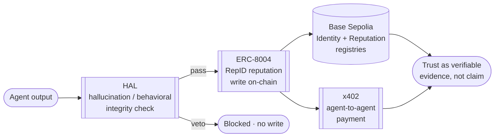
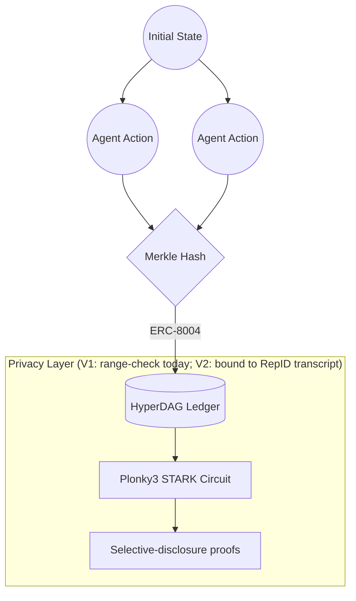

# HyperDAG Protocol

**Open implementation of ERC-8004 reputation primitives for autonomous agents. Apache 2.0.**

[](LICENSE)
[](https://ethereum-magicians.org/t/erc-8004-trustless-agents/25098)
[](https://www.npmjs.com/package/@hyperdag/protocol)
[](https://soliditylang.org)
[](https://sepolia.basescan.org/address/0x8004B663056A597Dffe9eCcC1965A193B7388713)
[](CONTRIBUTING.md)

HyperDAG is a lightweight, composable trust kernel for autonomous agents: six versioned interfaces (identity, reputation, validation, payment, linkage, hallucination) with curated defaults that target ERC-8004 + adjacent standards out of the box. Replace any layer you want; keep the rest.

---

## Live on Base Sepolia (chain ID 84532)

Both canonical registries are live on-chain, holding real minted identities and reputation writes. Everything below is verifiable from any RPC client or basescan. *(On-chain reputation writes resumed 2026-07-08 — 70 lifetime, verified via `/api/v1/observability/onchain-stats` — after a pause following 2026-06-22; cadence is being restored. See the honest note under Receipts. Reads and identity lookups are unaffected.)*

| Contract | Address |
|---|---|
| **IdentityRegistry** | [`0x8004A818BFB912233c491871b3d84c89A494BD9e`](https://sepolia.basescan.org/address/0x8004A818BFB912233c491871b3d84c89A494BD9e) |
| **ReputationRegistry** | [`0x8004B663056A597Dffe9eCcC1965A193B7388713`](https://sepolia.basescan.org/address/0x8004B663056A597Dffe9eCcC1965A193B7388713) |

---

## Repo health — what a reviewer can run today

The section above answers "are the contracts live". This one answers "is the
codebase healthy", which is the question a code reviewer actually has. Both
columns are current as of **2026-08-06** and every row is checkable locally.

| Works today | Command | Result |
|---|---|---|
| Clean install from the lockfile | `npm ci` | exits 0 |
| CI | `.github/workflows/ci.yml` | 4 jobs: install · contracts · coverage-map |
| HAL parity against production | `cd packages/defaults/hallucination-hal-local && npm test` | **11/11** — golden vectors captured from the upstream extractor |
| Contract test suite runs | `cd packages/contracts && npm test` | 61 tests execute (see the known failure below) |

| Known broken / not live | Actual state |
|---|---|
| **`ReputationRegistry` tests: 26 of 61 fail** | **One defect, not 26.** `NewFeedback` in the Solidity source carries a 12th parameter (`bytes x402PaymentProof`) that appears in neither `ERC8004SPEC.md:224` nor the checked-in `abis/ReputationRegistry.json`, both of which specify 11. That changes the event signature, so an ERC-8004-compliant indexer filtering the canonical `topic0` sees **zero** feedback events from this contract. Diagnosed, not patched — the spec's owner decides. |
| `@hyperdag/protocol` on npm | **not published** — `npm view` returns 404 |
| The six default packages (`@hyperdag/identity-erc8004`, `reputation-zkp`, `validation-trinity`, `payment-x402`, `linkage-registry`, `hallucination-hal`) | **not published** — 404 for all six |
| Six-interface kernel source | on `feat/modular-kernel-interfaces-2026-05-04`, **not on `main`** |
| `packages/protocol`, `packages/interfaces` | untracked `dist` output only; no rebuildable source |

**To use the trust layer today, install [`@hyperdag/trustshell`](https://www.npmjs.com/package/@hyperdag/trustshell)** — it is published, keyless for HAL scoring, RepID reads and ZK proofs, and it reaches the same contracts listed above.

> `hallucination-hal-local` and `identity-erc8004-viem` are the two packages that
> actually exist in this repo. Neither is one of the six names above. Until
> 2026-08-05 the HAL copy asserted byte-equivalence with production while being
> blind to prompt injection for three months; that is fixed and now held by the
> parity test in the table.

---

## Receipts

Real on-chain ERC-8004 activity from a production agent fleet. Every number is verifiable on basescan; honest gaps are noted inline.

- **All 12 trinity agents minted** on the canonical IdentityRegistry — the whole core fleet now holds ERC-8004 tokens (the earlier "4 minted, 8 queued" gap is closed):

  | Agent | Token ID | Agent | Token ID |
  |---|---|---|---|
  | `trinity-apm` | `1585` | `trinity-w3c` | `6706` |
  | `trinity-sophia` | `3747` | `trinity-torch` | `6707` |
  | `trinity-shofet` | `5863` | `trinity-gcm` | `6708` |
  | `trinity-veritas` | `5864` | `trinity-chesed` | `6709` |
  | `trinity-orch` | `6705` | `trinity-mel` | `6710` |
  | `trinity-nexus` | `6711` | `trinity-hdm` | `6712` |

- **92 lifetime on-chain reputation writes** from the agent economy — real production activity, not synthetic backfill (re-measured **2026-08-29** against `erc8004_reputation_writes`; the previous published figure of 70 was a 2026-07-08 snapshot and is superseded, not withdrawn). Gas per write: ~134,661. Most recent write: [`0xdaf4863b…`](https://sepolia.basescan.org/tx/0xdaf4863bf3c21d156d5d38c4c5c9e46288c4b6cf61c439c0bccd086fdd21ac73) at 2026-08-29 12:01:34 UTC — the minter re-reads the receipt from Base Sepolia (`status 0x1`, sent to the ReputationRegistry) and exits non-zero rather than record an unverified write, so every row here was confirmed against the chain and not against our own database.
  **Honest currency note — there have been two pauses, and the second is the more instructive.** The first ran **2026-06-22 → 2026-07-08** while the settlement path was re-wired. The second ran **2026-08-17 → 2026-08-29**: an upstream provider retired the model our peer-validation step called, so every validator returned an error — and the aggregation counted an unreachable validator as a score of **zero** rather than as *not measured*. The result was a confident failing verdict about work nobody had assessed, which disputed twelve consecutive runs. Both halves are fixed: the model is configuration rather than a literal, and a validator that does not answer is now excluded from the aggregate instead of counted against the provider.
  We publish the gap rather than the average. The reputation *history* on-chain remains fully verifiable — treat the count as a dated snapshot, not a fixed constant, and treat live cadence as something to re-probe rather than assume.

- **Epoch-1 reset:** RepID was reset to a neutral **1,000 baseline** for a clean start. Core agents now range **~1,000–1,520** (ESTABLISHED tier) as they re-earn from a level field.

- **Historical attestations (pre-reset — real, verifiable, but predate the Epoch-1 reset above; not current values):**
  - `sophia` → RepID **9,581** *(historical)* · [`0x24251cbb…ca9301`](https://sepolia.basescan.org/tx/0x24251cbb786d9ca8b03e4d56887a46f9040ddc1336826d80021ff39b91ca9301) · block 41,873,128
  - `apm` → RepID **7,010** *(historical)* · [`0x54da7350…ba2fd8`](https://sepolia.basescan.org/tx/0x54da7350eeed8527fcec80fb945bd7ff33dd2d98a5bacd50c1a0655692ba2fd8) · block 41,873,368
  - `veritas` → RepID **5,589** *(historical)* · [`0xa8474d5d…c9c2f2`](https://sepolia.basescan.org/tx/0xa8474d5dac601d3c04d0133f5cf55a9273d226e366a0a807b16691cfd7c9c2f2) · block 41,873,608
  - `shofet` → RepID **3,120** *(historical)* · [`0xb2ab22b5…caed09`](https://sepolia.basescan.org/tx/0xb2ab22b536abb7dc08d19a030b6e491face37387834dd361fba0d705accaed09) · block 41,934,427

---

## Three Trust Models — ERC-8004 → HyperDAG mapping

The trust promise is one flow across three protocols — **HAL** verifies behavior, **ERC-8004** anchors the earned reputation on-chain, **x402** settles agent-to-agent value — so trust is delivered as verifiable evidence, not a claim:


```mermaid
graph LR
    A([Agent output]) --> HAL[["HAL<br/>hallucination / behavioral<br/>integrity check"]]
    HAL -->|pass| REP[["ERC-8004<br/>RepID reputation<br/>write on-chain"]]
    HAL -->|veto| STOP([Blocked · no write])
    REP --> LEDGER[("Base Sepolia<br/>Identity + Reputation<br/>registries")]
    REP --> PAY[["x402<br/>agent-to-agent<br/>payment"]]
    LEDGER --> EV([Trust as verifiable<br/>evidence, not claim])
    PAY --> EV
```

ERC-8004 defines three composable trust mechanisms; HyperDAG ships one curated default for each, all swappable via the corresponding interfaces:

| ERC-8004 mechanism | HyperDAG default | How it works |
|---|---|---|
| **Reputation** (delegated trust via on-chain attestations) | `IReputation` → `@hyperdag/reputation-zkp` | Per-agent RepID 0–10,000; writes go to the canonical `ReputationRegistry` (live above). Selective-disclosure / private-ownership proofs via a Plonky3 STARK range-check today; the **roadmap-V2** circuit that binds the proof to the actual RepID-derivation transcript is in active development. |
| **Validation** (independent re-execution / cross-check) | `IValidation` → `@hyperdag/validation-trinity` | BFT validator set with HITL graduation; cross-LLM agreement check (Phase 1.5) for factual / time-sensitive prompts; `IHallucination` veto sits in the same chain. |
| **TEE Attestation** (verifiable execution receipts) | `IValidation` extension *(roadmap V2)* | First-class TEE-backed ValidationRegistry support is roadmap (see V2 below). The Plonky3 STARK in `@hyperdag/reputation-zkp` today proves a narrow range claim (`repid > threshold`); binding the proof to the agent decision + HAL signals is also V2. |

---

## Threat model — what the kernel defends against

| Class | What HyperDAG does |
|---|---|
| **Hallucination** | `IHallucination` (HAL) routes every agent decision through a 5-signal extractor (harm · epistemic uncertainty · evidence quality · scope · certainty) + optional 6th cross-LLM agreement signal. Pythagorean Comma combiner; runtime-tunable veto / block thresholds. |
| **Constitutional drift** | Thresholds (`hal_veto_threshold`, `hal_block_threshold`) and per-profile gating (conservative / balanced / pro) are stored in the engine's config — operators retune against live traffic without a redeploy. Drift is measured, not just blocked. |
| **Unproven identity** | `IIdentity` reads the canonical `IdentityRegistry`; standard ERC-8004 reputation/attestation lookups (`getRepID`, `getReputationHistory`, `getAttestation`) verify any counterparty before action. |
| **Reputation lock-in** | RepID is anchored on ERC-8004 (portable on-chain). Move an agent between platforms without losing earned trust. |

---

## Quick start

> **⚠ `@hyperdag/protocol` is not published yet.** `npm view @hyperdag/protocol` returns 404, and
> the kernel source is not on `main` — it lives on `feat/modular-kernel-interfaces-2026-05-04`.
> The interface design is real and the contracts are live on Base Sepolia, but there is nothing to
> install from *this* repo today. This section previously opened with
> `npm install @hyperdag/protocol` as though it shipped.

**To use the trust layer right now**, install the SDK that is published and working:

```bash
npm install @hyperdag/trustshell
```

That bundles HAL hallucination filtering, portable ERC-8004 RepID, and x402 payments in one
install — see **[`@hyperdag/trustshell`](https://github.com/DealAppSeo/trustshell)** and the
[Public ecosystem](#public-ecosystem) table below.

**AI-native install (no terminal).** The same three protocols — HAL verification, ERC-8004 RepID, and x402 payments — are also live as an MCP server that an AI (Claude Desktop / Cursor) can call directly as tools: **[`@hyperdag/trustshell-mcp`](https://www.npmjs.com/package/@hyperdag/trustshell-mcp)**. Run it with `npx @hyperdag/trustshell-mcp`, or add it to your Claude Desktop / Cursor config:

```json
{"mcpServers":{"trustshell":{"command":"npx","args":["-y","@hyperdag/trustshell-mcp"]}}}
```

*(Installing the SDK straight from GitHub — `github:DealAppSeo/trustshell` — is coming.)*

### Which package do I install?

| If you're… | Install | What you get |
|---|---|---|
| A developer building an agent/app **in code** | `npm install @hyperdag/trustshell` | The SDK — HAL verification + ERC-8004 RepID + x402 payments, in your TypeScript/JS |
| Using an **AI tool** (Claude Desktop, Cursor, Windsurf), **no code** | `npx @hyperdag/trustshell-mcp` | The same three protocols as AI-callable tools — zero terminal |
| Only verifying **ZK proofs** client-side | `npm install @hyperdag/proof-verifier` | Standalone Plonky3 proof checking (usually bundled with trustshell — rarely installed directly) |

**Most people want `@hyperdag/trustshell` (building in code) or `@hyperdag/trustshell-mcp` (adding trust to your AI, no code). `proof-verifier` is a building block that ships inside trustshell.**

*(This `@hyperdag/protocol` package is the interface kernel. It is not on npm yet — see the notice above.)*

Working SDK call, against the published package:

```typescript
import { TrustShell } from '@hyperdag/trustshell';

const shell = new TrustShell();                    // keyless for scoring
const r = await shell.verifyOutput('Paris is the capital of France.');

if (!r.ok) console.log('HAL vetoed:', r.decisionReason);
else       console.log('trust', r.trustScore, '/ 100');
```

The kernel API **once published** — shown as a design target, not a shipped surface:

```typescript
import { createHDP } from '@hyperdag/protocol';   // not on npm yet

const hdp = createHDP({ network: 'base-sepolia' });
const result = await hdp.hallucination.evaluate({
  prompt: "What's the capital of France?",
  output: "Paris.",
  context: { agentId: 3749 }
});
```

---

## Modular trust kernel — six interfaces, six defaults

HDP is not a heavy wrapper. It is a lightweight kernel defining clean versioned interfaces; the curated defaults work out of the box and can be replaced piece-by-piece.

**None of the six default packages are on npm yet** (`npm view` returns 404 for each), and the
interface source is on a feature branch rather than `main`. The `status` column is the honest
state, not a roadmap — the design is settled, the packaging is not.

| Interface | Default | Wraps | Status |
| :--- | :--- | :--- | :--- |
| `IIdentity` | `@hyperdag/identity-erc8004` | ERC-8004 IdentityRegistry | contracts live on Base Sepolia; package unpublished |
| `IReputation` | `@hyperdag/reputation-zkp` | On-chain RepID via ERC-8004 ReputationRegistry; ZKP for private-ownership / range proofs (Plonky3 range-check today — V2 binds to the RepID transcript) | contracts + proofs live; package unpublished |
| `IValidation` | `@hyperdag/validation-trinity` | BFT validators (with HITL graduation) | running in the engine; package unpublished |
| `IPayment` | `@hyperdag/payment-x402` | x402 | settlements live on Base Sepolia; package unpublished |
| `ILinkage` | `@hyperdag/linkage-registry` | HDP Linkage Registry (inverse-stake curve) | design only |
| `IHallucination` | `@hyperdag/hallucination-hal` | HAL (Pythagorean Comma BFT veto) | running in the engine + shipped inside `@hyperdag/trustshell`; standalone package unpublished |

The two packages that **do** exist in this repo are `packages/defaults/hallucination-hal-local`
(`private`, `0.1.0-internal`) and `packages/defaults/identity-erc8004-viem` (`0.1.0-alpha`) —
neither is one of the six names above.

> *"Stay light as long as you can. Adopt only the layers you need."*

Replace any default at install time: `createHDP({ overrides: { ... } })`.

### Verification flow


```mermaid
graph TD
    Node1((Initial State)) --> Node2((Agent Action))
    Node1 --> Node3((Agent Action))
    Node2 & Node3 --> Node4{Merkle Hash}
    Node4 -->|ERC-8004| Chain[(HyperDAG Ledger)]

    subgraph "Privacy Layer (V1: range-check today; V2: bound to RepID transcript)"
    Chain --> ZKP[Plonky3 STARK Circuit]
    ZKP --> Creds[Selective-disclosure proofs]
    end
```

### Core building blocks
- **Merkle DAG** — content-addressed, append-only verifiable state.
- **ZKP for private ownership** — Plonky3 STARK (BabyBear field, Keccak FRI) range-check today; roadmap-V2 circuit binds the proof to the agent decision + HAL signals + RepID-delta derivation.
- **[ERC-8004](https://ethereum-magicians.org/t/erc-8004-trustless-agents/25098)** — standards-based identity + reputation for autonomous agents.
- **[x402](https://github.com/x402-rs/x402-rs)** — agent-to-agent micropayments.
- **[Plonky3](https://github.com/Plonky3/Plonky3)** — STARK proving, no trusted setup, fast browser verification.

---

## Roadmap

| Phase | Target | Highlights |
|---|---|---|
| **V1 — Live today (Base Sepolia)** | shipping now | IdentityRegistry + ReputationRegistry live on Base Sepolia (all 12 core agents minted, 70+ lifetime reputation writes) · HAL pipeline + cross-LLM agreement · x402 settlements · all reachable today through **[`@hyperdag/trustshell`](https://www.npmjs.com/package/@hyperdag/trustshell)**, which is published. The six-interface kernel is **designed and branch-only**; `@hyperdag/protocol` is **not on npm** (this row previously claimed `@hyperdag/protocol@0.1.0-alpha` was published). |
| **V1.5 — User-managed permission guardrails** | 1–2 weeks | Telegram (and later email/discord/webhook) alerts when an agent attempts an action outside its lane. Six RepID-derived permission tiers (Probationary → Architect) map score to capability. Substrate is live; client SDK lands at install. |
| **V2 — Mainnet** | Q2 2026 | Canonical registries on Base mainnet · TEE-backed ValidationRegistry path · **ZKP RepID circuit bound to agent decision + HAL signals + RepID-delta transcript (extension of today's Plonky3 range-check)** · ZKP-federated learning (bilateral benefit) · expanded validator-set diversity. |

See [GOVERNANCE_ROADMAP.md](GOVERNANCE_ROADMAP.md) for the bootstrap-to-community handover timeline.

---

## Public ecosystem

All Apache 2.0; all open:

| Repo | Role |
|---|---|
| **[hyperdag-protocol](https://github.com/DealAppSeo/hyperdag-protocol)** *(you are here)* | The interface kernel + curated defaults |
| **[@hyperdag/trustshell](https://github.com/DealAppSeo/trustshell)** | Drop-in npm client: `shell.evaluate(...)` for HAL, ERC-8004 read helpers, x402 client SDK |
| **[example-agent](https://github.com/DealAppSeo/example-agent)** | 60-second demo agent — keyless HAL fact-check + SDK mode |
| **[trustrepid](https://github.com/DealAppSeo/trustrepid)** | Live RepID leaderboard + per-LLM trust scores |
| **[trustchat-backend](https://github.com/DealAppSeo/trustchat-backend)** | HAL-aware chat backend (reference consumer) |

---

## Contributors

Maintained by **Sean Goodwin**. The full contributor list — including everyone whose commits appear in this repository's history — is authoritatively the [GitHub contributors page](https://github.com/DealAppSeo/hyperdag-protocol/graphs/contributors), not this README. We do not list individuals here to avoid implying endorsement.

This implementation builds on the **ERC-8004 standard** (Trustless Agents). The standard's authors are public on the EIP and its reference repos; we cite them factually in [METHODOLOGY.md](METHODOLOGY.md), not as contributors to this fork.

PRs welcome — see [CONTRIBUTING.md](CONTRIBUTING.md) and [SECURITY.md](SECURITY.md). For governance, see [GOVERNANCE_ROADMAP.md](GOVERNANCE_ROADMAP.md).

---

## License

Apache 2.0 — see [LICENSE](LICENSE). Patent rights, if any, are granted under the Apache 2.0 patent grant clause.

---

*"He hath shewed thee, O man, what is good; and what doth the LORD require of thee, but to do justly, and to love mercy, and to walk humbly with thy God?"* — Micah 6:8
